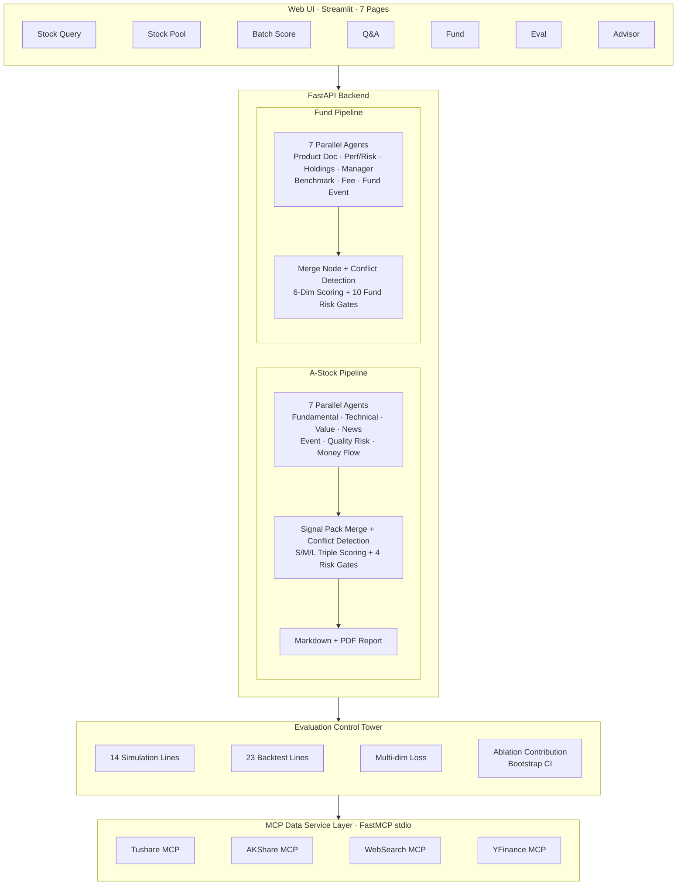
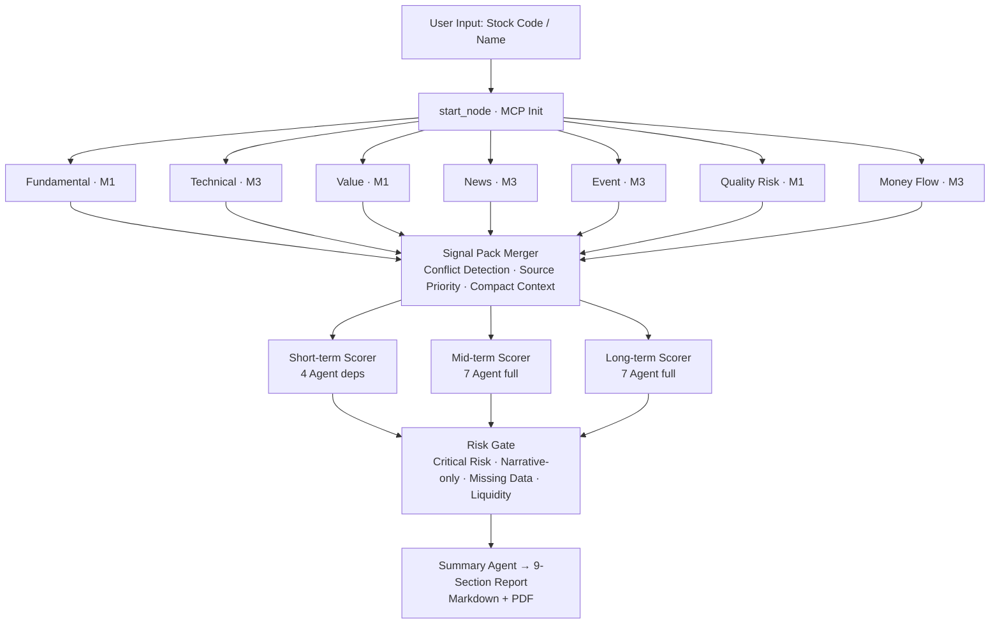
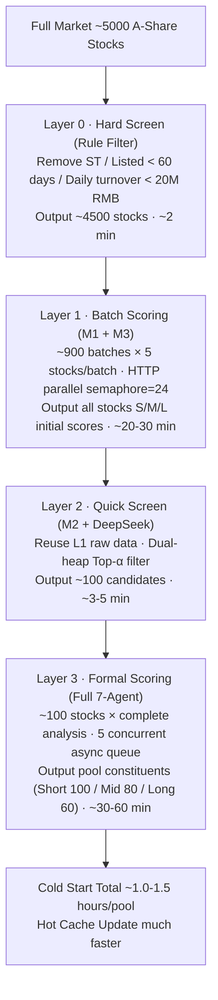
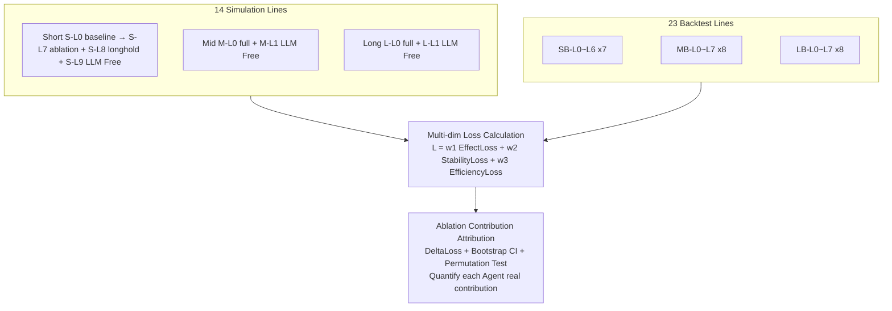
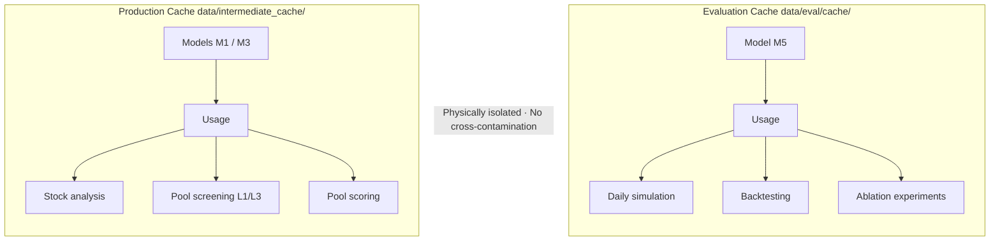

# A-Stock Investment Advisor Agent

> **Disclaimer:** This project is for learning and research purposes only and does not constitute any investment advice. Users are solely responsible for any losses incurred from real trading using this system.

<div align="center">

[](https://www.python.org/)
[](https://github.com/langchain-ai/langgraph)
[](https://modelcontextprotocol.io/)
[](https://streamlit.io/)
[](./LICENSE)
[](https://tushare.pro/)

**[中文文档](./README.md) | English**

</div>

> **Professional Multi-Agent Investment Research Platform** — LangGraph-based 7-agent parallel analysis + short/medium/long-term triple scoring + 14 simulation lines + 23 backtest lines + ablation experiment contribution evaluation system. Covers A-share stocks and funds/ETFs. Dual-version architecture: Lite (single API key, zero-cost trial) and Full (6 specialized models).

---

## Introduction

This project is an open-source multi-agent analysis platform for **A-share (Chinese stock market) investment research**, positioned as an **AI-driven investment research assistant tool**. It explores the application potential of Large Language Models (LLMs) in financial data analysis, multi-dimensional stock/fund evaluation, and strategy backtesting.

**Core Positioning**: This is a **research tool**, not an investment product. It helps researchers, students, and quantitative enthusiasts understand how to use multi-agent collaboration frameworks for structured investment research analysis.

**Key Features**:
- 7 specialized analysis Agents running in parallel with cross-validation
- Structured evidence system (SignalPack) with data support and source labeling
- Built-in anti-hallucination design, strictly distinguishing data facts from model inferences
- Complete evaluation control tower (14 simulation lines + 23 backtest lines) with ablation experiments
- Dual-cache architecture, skipping LLM calls on cache hits
- **Dual-version architecture**: Lite mode requires only 1 DeepSeek API key + free Tushare for zero-cost trial; Full mode supports 6 specialized models + Tushare 5000+ points

---

> ### **Important Disclaimer**
>
> 1. **This project is for learning, research, and exchange purposes only and does not constitute any investment advice.** Analysis results, scores, and reports are automatically generated by AI models and may contain errors, biases, or hallucinations. Any investment decisions based on this project are the sole responsibility of the investor.
>
> 2. **This project only publishes code and system architecture, not any actual A-share market data, financial data, or trading data.** All data is obtained locally by users in real-time via Tushare Pro API and AKShare API.
>
> 3. **This project strictly complies with the terms of service of Tushare Pro and AKShare, and is only used for non-commercial academic research and personal learning.** Users must also comply with relevant data source service agreements.

---

## Dual-Version Architecture

The system supports two operating modes:

| | Lite | Full (default) |
|---|---|---|
| **LLM** | 1 DeepSeek API Key → all agents | 6 specialized models (M1–M6) |
| **Data** | Free Tushare (120 pts) + AKShare fallback | Tushare 5000+ pts |
| **Pages** | 5/7 (Eval + Advisory locked) | All 7 pages |
| **Use case** | Trial, learning, zero-cost entry | Production research |

**Transparent degradation in Lite mode**:
- The MCP Server layer automatically falls back Tushare API calls to AKShare equivalents (covering 8 API types)
- **Agents are completely unaware** — the same 7 agents call the same MCP tools in both modes
- First-run onboarding wizard guides users through version selection and API key configuration

---

## Architecture Overview

### Two-Layer Architecture



### Single-Stock Deep Analysis Pipeline



### Four-Layer Stock Screening Pipeline



### Evaluation Control Tower Architecture



### Cache Isolation Architecture



---

## Installation

### Prerequisites

| Dependency | Lite | Full |
|------------|------|------|
| Python 3.10+ | Recommended 3.11 | Recommended 3.11 |
| Tushare Pro Token | [Free registration](https://tushare.pro/) (120 pts sufficient) | [Register](https://tushare.pro/) (requires ≥ 2000 pts) |
| LLM API Keys | Only 1 DeepSeek key | MiMo / DeepSeek / Qwen — 6 keys total |
| Git | Clone repository | Clone repository |

### Installation Steps

```bash
# 1. Clone repository
git clone https://github.com/lyd14753-coder/A-Share-Intelligent-Investment-Advisory-Project-Based-on-LLM.git
cd A-Share-Intelligent-Investment-Advisory-Project-Based-on-LLM

# 2. Create virtual environment
python -m venv venv
source venv/bin/activate        # Linux / macOS
# or venv\Scripts\activate      # Windows

# 3. Install dependencies
cd Finance
pip install -r requirements.txt

# 4. Configure environment variables
cd Financial-MCP-Agent
cp .env.example .env
# Edit .env:
#   Lite: set APP_MODE=lite + DEEPSEEK_API_KEY
#   Full: set APP_MODE=full + 6 model API Keys
```

> **First run**: The system automatically launches an onboarding wizard that guides you through version selection and API key configuration — no manual `.env` editing needed.

### Start Web UI

```bash
# Linux / macOS
./run.sh start

# Windows CMD
run.bat start

# Windows PowerShell
.\run.ps1 start
```

> **macOS users**: macOS uses the same `run.sh` script as Linux. Ensure Python 3.10+ and Git are installed (`brew install python git`). If you encounter permission issues, run `chmod +x run.sh` first.

Open `http://localhost:8501` in your browser.

### Multi-Model Configuration (Full Mode)

Full mode uses **6 independent LLM models**, assigned by task characteristics:

| Code | Default Model | Roles |
|------|---------------|-------|
| **M1** | MiMo-V2.5-Pro | Summary reports, mid/long-term scoring, fundamental, value, quality risk |
| **M2** | Qwen3.6-Flash | Quick queries, quick screening, batch scoring |
| **M3** | Qwen3.7-Plus | Technical, news, short-term scoring, events, money flow |
| **M4** | (migrated to M1) | Reserved slot |
| **M5** | MiMo-V2.5 | Evaluation system Agent analysis (cost optimization), Q&A |
| **M6** | DeepSeek V4 Pro | Evaluation orchestration, attribution diagnosis, report writing, LLM Free strategies |

Lite mode routes all agents to DeepSeek V4 Pro (complex tasks) or DeepSeek V4 Flash (quick tasks) automatically.

---

## Project Structure

```
A-Share-Intelligent-Investment-Advisory-Project-Based-on-LLM/
├── Finance/
│   ├── a-share-mcp-server/              # MCP Data Service Layer
│   │   ├── tushare_mcp_server.py        # Tushare MCP Server (primary + Lite AKShare fallback)
│   │   ├── mcp_server.py                # AKShare MCP Server (supplementary)
│   │   ├── web_search_mcp_server.py     # Web Search MCP Server
│   │   └── yfinance_mcp_server.py       # Yahoo Finance MCP Server
│   └── Financial-MCP-Agent/             # Main Application
│       ├── src/
│       │   ├── agents/                  # 7 A-Stock Agents + 7 Fund Agents + Scoring Agents
│       │   ├── advisory/                # Advisory subsystem (strategy engine + portfolio + backtest)
│       │   ├── stock_pool/              # Stock pool & 4-layer screening pipeline
│       │   ├── qa/                      # Q&A engine
│       │   ├── eval/                    # Evaluation tower (simulation, backtest, ablation)
│       │   ├── data/                    # Unified data layer (Tushare + AKShare auto-fallback)
│       │   ├── tools/                   # MCP client & tool cache
│       │   ├── utils/                   # Cache, model config, industry knowledge, risk gates, mode manager
│       │   ├── api/                     # FastAPI backend
│       │   ├── app/                     # Streamlit Web UI (7 pages + onboarding)
│       │   ├── fund_pool/               # Fund pool management
│       │   ├── main.py                  # Single-stock analysis entry
│       │   ├── main_pool.py             # Stock pool CLI entry
│       │   └── fund_main.py             # Fund analysis CLI entry
│       ├── data/                        # Cache & persistent data (not tracked in git)
│       ├── tests/                       # Unit tests (25+ test files)
│       └── run.sh / run.bat / run.ps1   # Startup scripts
├── CLAUDE.md                            # Developer Guide
├── CONTRIBUTING.md                      # Contribution Guide
├── CODE_OF_CONDUCT.md                   # Code of Conduct
├── SECURITY.md                          # Security Policy
├── pyproject.toml                       # Python package configuration
└── README.md / README_EN.md
```

---

## Known Limitations

1. **High cold-start cost**: First-time pool screening takes ~1.5–2 hours/pool and consumes significant LLM API quota.
2. **Eval and Advisory features still maturing**: Some ablation experiment lines lack sufficient statistical samples; Advisory sub-features have limited implementation depth.
3. **Data source dependency**: A-share data primarily relies on Tushare Pro — Full mode cannot operate when Tushare is unavailable. Lite mode partially mitigates this via AKShare auto-fallback, but coverage is narrower.
4. **External model API dependency**: Full mode uses 6 models from 3 vendors (Xiaomi/Alibaba/DeepSeek) — any vendor's API change or outage may affect corresponding features. Lite mode depends solely on DeepSeek, reducing vendor sprawl but creating a single point of dependency.
5. **Backtest limitations**: Results are based on historical data and do not represent future performance. Strategy implementations are pure-code rules that do not fully account for real-world liquidity shocks or trading suspensions.

We welcome community contributions to address these limitations.

---

## Acknowledgments

The foundational architecture of this project was inspired by blogger **居丽叶 (Julie)**'s "居丽叶简历项目3：股票投资顾问Agent" (Julie's Resume Project 3: Stock Investment Advisor Agent), with portions of code reused under permission. The strategy architecture design was inspired by community projects such as [fin-agent](https://github.com/YUHAI0/fin-agent). Sincere thanks to the above projects and their developers.

---

## Contributing

This project is actively developed. We welcome Issues and Pull Requests.

Before submitting a PR, please ensure:
- Code style is consistent with existing code
- New Agents must output `<SIGNAL_PACK>` structured JSON
- Do not hardcode model names, use `model_config.py` configuration mapping
- Evaluation system changes must not pollute production cache (use `cache_namespace="eval"`)
- Lite mode logic must be inside `if is_lite_mode()` branches — Full mode code paths must remain untouched

See [CONTRIBUTING.md](./CONTRIBUTING.md) for detailed contribution guidelines.

---

## Legal Compliance & Data Disclaimer

1. **Non-Commercial Use**: This project strictly complies with [Tushare Pro Data Service Agreement](https://tushare.pro/) and [AKShare Terms of Use](https://akshare.akfamily.xyz/), and is only used for non-commercial academic research and personal learning.

2. **Data Localization**: All financial data is obtained locally by users in real-time via APIs. The project repository does not contain any user data or financial data.

3. **No Investment Advice**: All analysis results, scores, reports, and dialogue content are automatically generated by AI models and may contain errors, biases, or hallucinations. This project does not constitute any form of investment advice.

4. **Liability Disclaimer**: The project author and all contributors are not liable for any direct, indirect, incidental, or consequential losses arising from the use of this project.

5. **Data Source Compliance**:

> | Data Source | Purpose | Service Agreement | Notes |
> |-------------|---------|-------------------|-------|
> | [Tushare Pro](https://tushare.pro/) | A-share market, financial, capital flow data | [Tushare Agreement](https://tushare.pro/document/2?doc_id=108) | Requires Token (≥ 2000 points), non-commercial only |
> | [AKShare](https://akshare.akfamily.xyz/) | International/macro/commodity + Lite A-share fallback | [AKShare Terms](https://akshare.akfamily.xyz/data/others/others.html) | Open source, cite data source |
> | [Yahoo Finance](https://finance.yahoo.com/) | International markets/exchange rates/commodities | [Yahoo ToS](https://legal.yahoo.com/us/en/yahoo/terms/otos/index.html) | Personal non-commercial only |

---

## License

This project is licensed under the [PolyForm Noncommercial License 1.0.0](./LICENSE), allowing non-commercial use for academic research, learning, and development, but **strictly prohibiting any commercial use**. For commercial licensing, please contact the project maintainer.

---

<div align="center">

**This project is for research purposes only and does not constitute investment advice.**

⭐ If this project is helpful to your research, please give it a Star!

</div>
